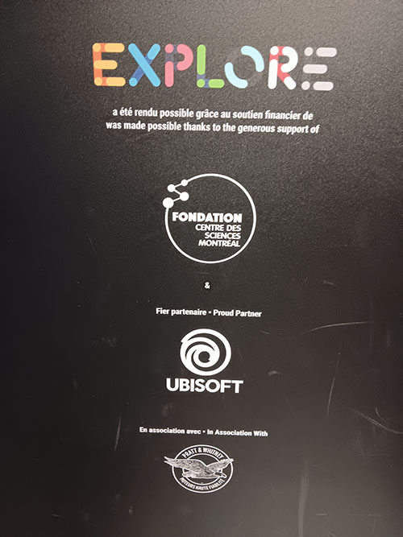
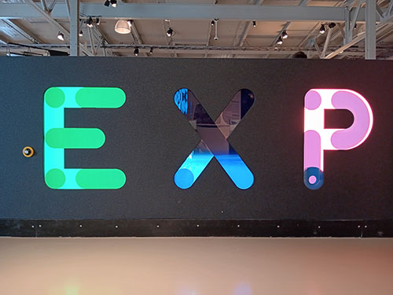
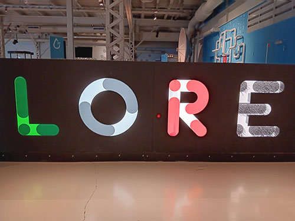
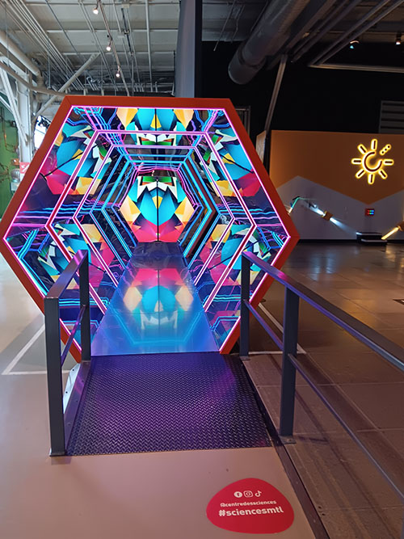

# Explore

une exposition intéractif sur des éléments scientifiques et avec des jeux de lumière et réflexion 

## Information générale de l'exposition

- Nom de l'exposition : Explore
  

 
 

>Affiche principale , Prise par Colin Dubé

- Lieu : Centre des Sciences de Montreal

>Entrée de l'exposition , Prise par Colin Dubé

- Type d'exposition : intérieur, permanente

- Date de visite : 2 Avril 2026

## Dispositif choisi

- Titre du dispositif : Kaleidoscope Géant

>Vue d'ensemble du dispositif , Prise par Colin Dubé

- Équipe complète : 

- Année de réalisation : 28 novembre 2019

- Type d'installation : interactive

- Description du dispositif : Un écran avec une animation en boucle qui est ensuite en reflection avec plein de miroir autour . Cela donne un effet étourdissant et intéressent pour les yeux.

>Texte explicatif du dispositif , Prise du site web de l'équipe d'artiste(mentionné dans les références)

- Mise en espace : 

>Schéma de plantation du dispositif , Prise du site web de l'équipe d'artiste(mentionné dans les références)

- Composantes et technique : Miroirs , 2 Écrans , Lumière

>Composantes du dispositif , Prise par Colin Dubé

- Éléments nécessaires à la mise en exposition : Clôture et sol en métal en élévation , poteau en metal pour explication .

>Éléments nécessaires à la mise en exposition , Prise du site web de l'équipe d'artiste(mentionné dans les références)

## Expérience vécue

La personne regarde au loin le kaleiodoscope et voit plein de motifs sur chaque coté.Ensuite la personne marche a l'intérieur du Kaleidoscope et regarde et remarque que les motifs sont seulemtn sur 2 écrans séparé qui 
reflète sur des miroirs.

## Ce qui m'a plu, ce qui m'a donné des idées, ce que je ne souhaite pas retenir pour mes créations et ce que je ferai de différent

J'ai aimé la petite expérience , la couleur du dispositif et les motifs choisi avec l'éclairage te donne vraiment une vue incroyable pour les yeux et te fait sentir en peu en mouvement dans une dimension inconnu, te laissant prendre place a ton imagination. Je ne changerai rien de ce dispositif a pars l'ajout de nouveau motifs pour voir plein de résultat différents.
