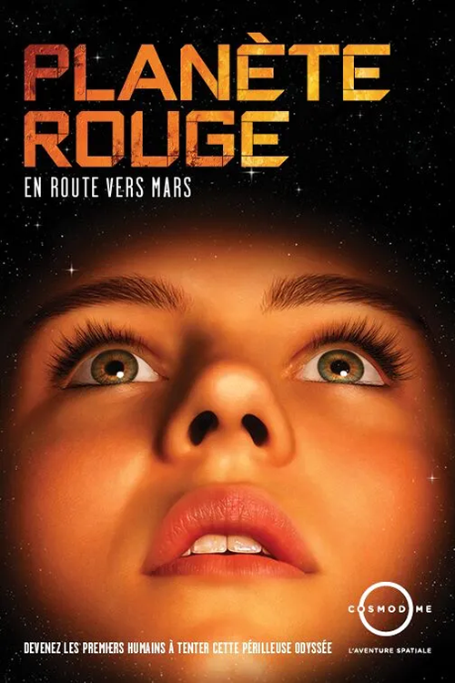
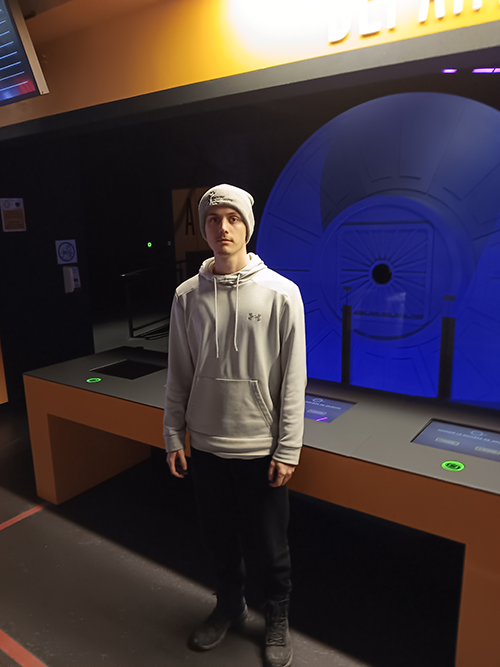

# Devenirs Partagés - Pratique de l'IA

Une exposition sur mars

## Information générale de l'exposition

- **Nom de l'exposition:** Mission Virtuelle

 

>Affiche principale pris du site web de l'exposition(mentionné dans les références) 

>Texte principal , pris du site web de l'exposition(mentionné dans les références)

- **Lieu:** Cosmodôme

>Entrée de l'exposition , Prise par employé

- **Type d'exposition :** intérieur, permanente

- **Date de visite:** 23 février

## Œuvre choisie

- **Titre de l'œuvre :** La planète rouge (en route vers Mars)

>Vue d'ensemble de l'oeuvre , Prise par Colin Dubé

- **Nom de la firme:** GSM Project

- **Année de réalisation:** 2011

- **Type d'installation :** immersive , intéractive

  

>Vue d'ensemble de l'instalation , Prise par Colin Dubé

- **Description de l'œuvre :** exposition sur avant , pendant et après un voyage sur mars. Les ressources et actions a prendre pendant un tel voyage.

>Cartel de l'oeuvre , pris du site web de l'exposition(mentionné dans les références)

- **Mise en espace :** chaise, casque VR, écran, mur de papier, internet

>croquis de la mise en espace de l'oeuvre , Prise par Colin Dubé

- **Composantes et technique :** Porte automatique, Écran de différente taille(petit,moyen,grand), rond scanneur, Moniteur intéractif, speaker

>Composantes de l'exposition , Prise par Colin Dubé

- **Éléments nécessaires à la mise en exposition:**

  Banc seul et long, Lumière au plafond ,sur les murs , ou les pilliers, Barre en métal, sol creux, Clôture en métal, pillier, Mur en angle, table hauteur hanche et hauteur épaule.

>Éléments nécessaires à la mise en exposition , Prise par Colin Dubé

## Expérience vécue

## Ce qui m'a plu, ce qui m'a donné des idées, ce que je ne souhaite pas retenir pour mes créations et ce que je ferai de différent

- **Références:**

 site web de la firme(https://gsmproject.com/fr/projets/etude-de-cas/le-cosmodome/)
 
 site web de l'exposition(https://cosmodome.org/activites-familiale/missions-virtuelles/)

