# Mission Virtuelle - La Planète Rouge

Une exposition sur mars

## Information générale de l'exposition

- **Nom de l'exposition:** Mission Virtuelle

 

>Affiche principale pris du site web de l'exposition(mentionné dans les références) 

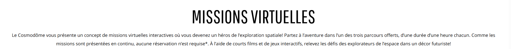

>Texte principal , pris du site web de l'exposition(mentionné dans les références)

- **Lieu:** Cosmodôme

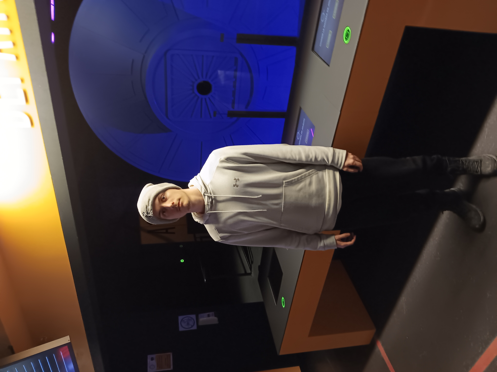 

>Entrée de l'exposition , Prise par employé du cosmodôme

- **Type d'exposition :** intérieur, permanente

- **Date de visite:** 23 février

## Dispositif choisi

- **Titre du dispositif :** La planète rouge (en route vers Mars)

  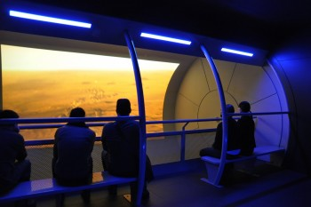
  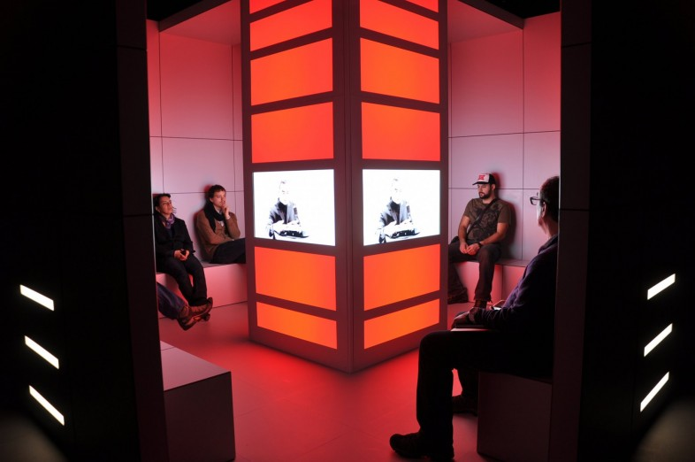
  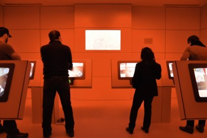
  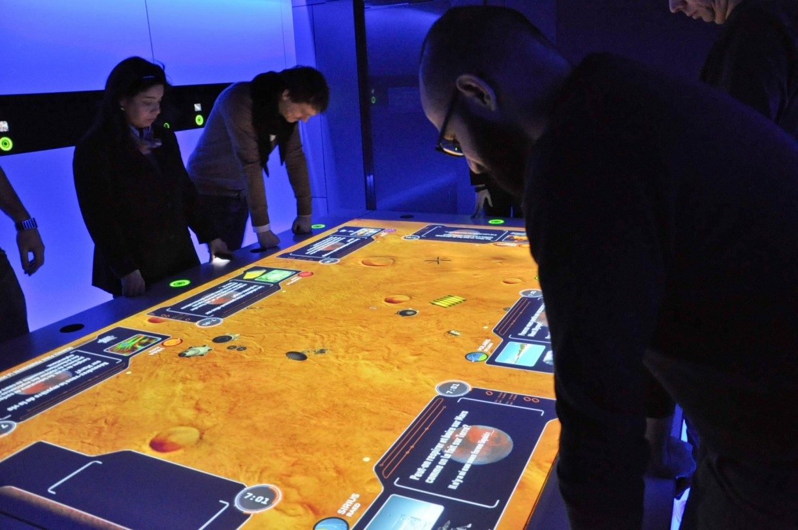
  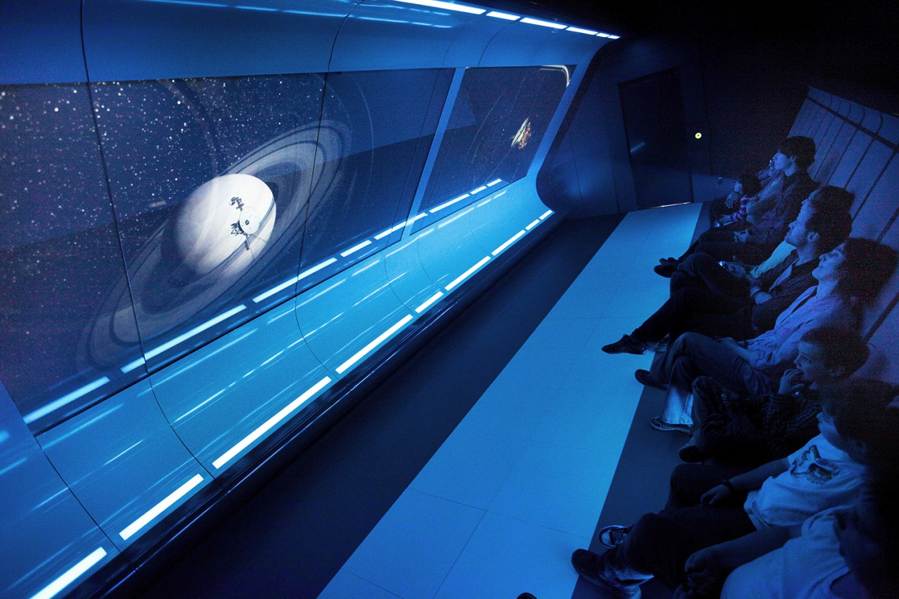

>Vue d'ensemble de l'oeuvre ,  pris du site web de la firme(mentionné dans les références)

- **Nom de la firme:** GSM Project

- **Année de réalisation:** 2011

- **Type d'installation :** immersive , intéractive

- **Description de l'œuvre :** exposition sur avant , pendant et après un voyage sur mars. Les ressources et actions a prendre pendant un tel voyage.

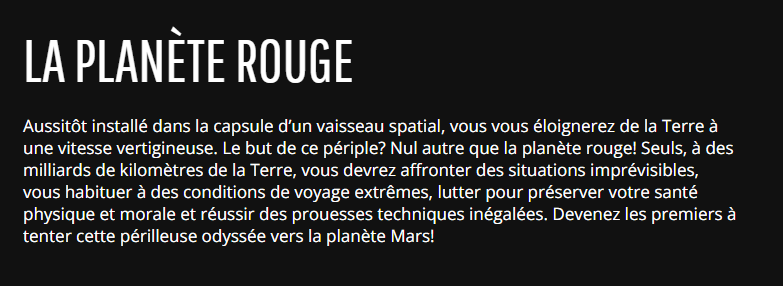

>Texte explicatif de l'oeuvre , pris du site web de l'exposition(mentionné dans les références)

- **Mise en espace :** "Légende dans chaque croquis"

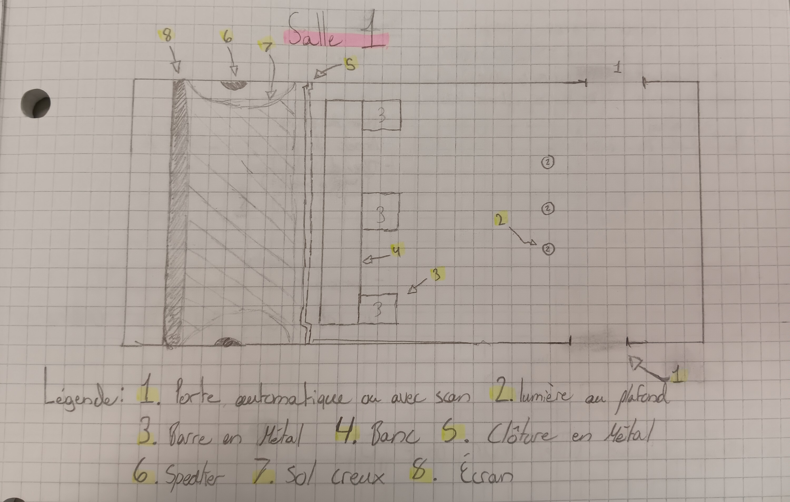

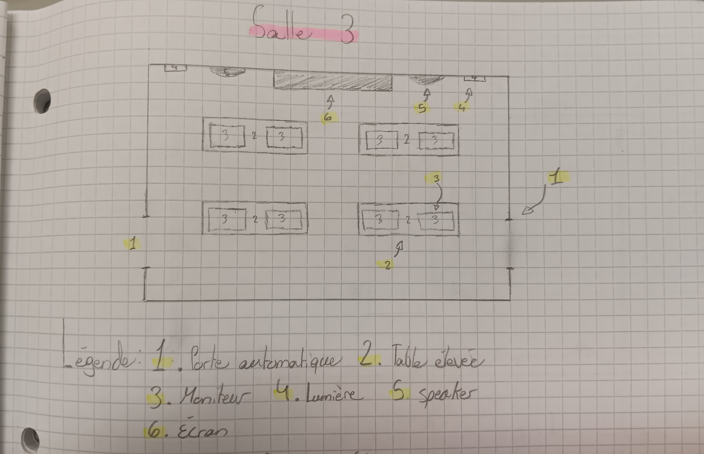
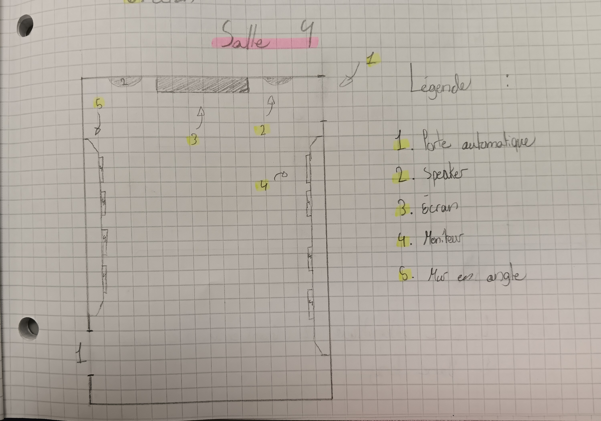
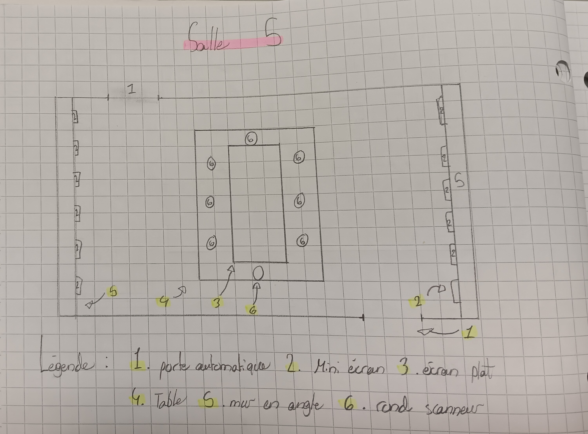
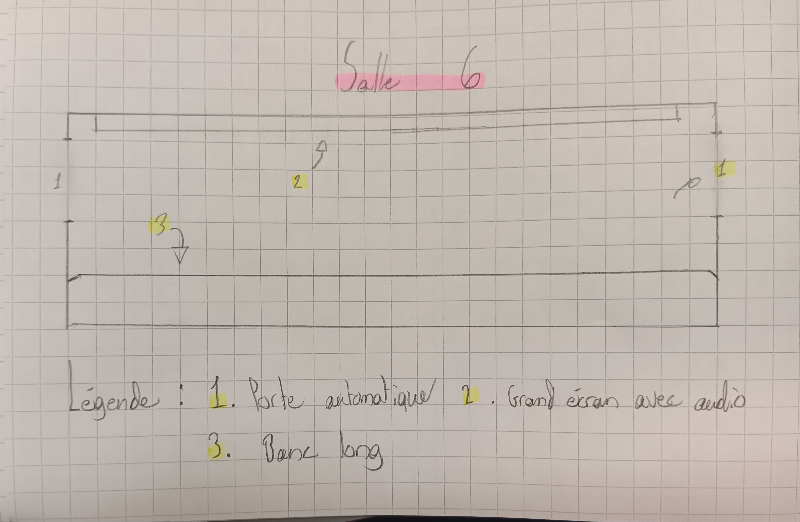

>croquis de la mise en espace de l'oeuvre , Prise par Colin Dubé

- **Composantes et technique :**

  Porte automatique, Écran de différente taille(petit,moyen,grand), rond scanneur, Moniteur intéractif, speaker

- **Éléments nécessaires à la mise en exposition:**

  Banc seul et long, Lumière au plafond ,sur les murs , ou les pilliers, Barre en métal, sol creux, Clôture en métal, pillier, Mur en angle, table hauteur hanche et hauteur épaule.

## Expérience vécue

Voyage de pièce en pièces chacune contenant une capsule vidéo avec de l'information ou des instructions. Pour bouger d'une pièce a l'autre, la capsule vidéo de la pièce ou tu es dans le moment t'averti la bonne porte souvrira automatiquement. Tu as une minute pour te déplacer a la prochaine salle. Si tu es trop lent et que la porte se referme, tu peu scanner la porte avec ton bracelet qu'on te donne au début de la mission. Pendant la mission, tu pouvais aussi intéragir avec les moniteurs avec ton bracelet et tes mains. 

Voici a quoi ressemblait les couloirs pour se déplacer d'une pièce a l'autre:

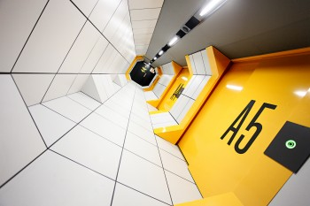

## Ce qui m'a plu, ce qui m'a donné des idées, ce que je ne souhaite pas retenir pour mes créations et ce que je ferai de différent

- **Références:**

 site web de la firme(https://gsmproject.com/fr/projets/etude-de-cas/le-cosmodome/)
 
 site web de l'exposition(https://cosmodome.org/activites-familiale/missions-virtuelles/)

