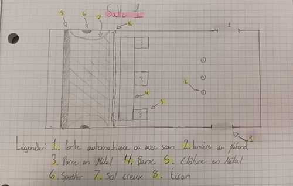
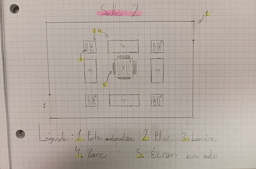
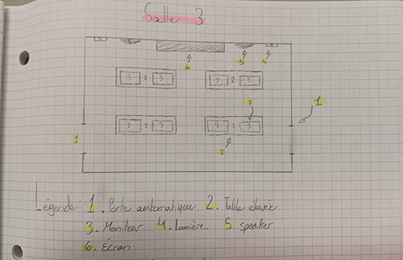
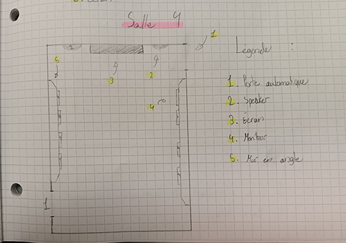
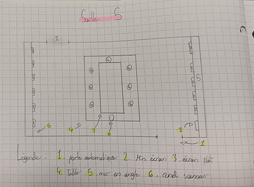
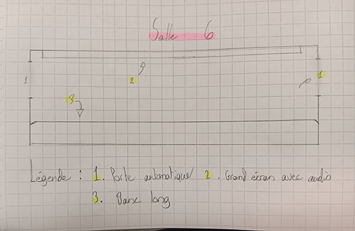

# Mission Virtuelle - La Planète Rouge

Une exposition sur Mars

## Information générale de l'exposition

- Nom de l'exposition : Mission Virtuelle

 

>Affiche principale pris du site web de l'exposition(mentionné dans les références) 

>Texte principal , pris du site web de l'exposition(mentionné dans les références)

- Lieu : Cosmodôme

 

>Entrée de l'exposition , Prise par employé du cosmodôme

- Type d'exposition : intérieur, permanente

- Date de visite : 23 février

## Dispositif choisi

- Titre du dispositif : La planète rouge (en route vers Mars).

Salle 1

Salle 2

Salle 3

Salle 5

Salle 6

  >Vue d'ensemble de l'oeuvre ,  pris du site web de la firme(mentionné dans les références)

- Nom de la firme : GSM Project

- Année de réalisation : 2011

- Type d'installation : immersive, interactive

- Description du dispositif :

  exposition sur avant, pendant et après un voyage sur Mars Les ressources et actions à prendre pendant un tel voyage.

>Texte explicatif de l'oeuvre , pris du site web de l'exposition(mentionné dans les références)

- Fonction du dispositif :

  Capsule vidéo servant à apprendre comment un voyage à Mars se produirait en plus d'apprendre l'histoire et l'information sur le sujet.

- Mise en espace : "Légende dans chaque croquis".

>croquis de la mise en espace de l'oeuvre , Prise par Colin Dubé

- Composantes et technique :

  Porte automatique, Écran de différentes tailles (petit, moyen, grand), rond scanneur, Moniteur interactif, speaker

- Éléments nécessaires à la mise en exposition :

  Banc seul et long, Lumière au plafond, sur les murs, ou les piliers Barre en métal, sol creux, Clôture en métal, pilier Mur en angle, table hauteur hanche et hauteur épaule.

## Expérience vécue

Voyage de pièce en pièce, chacune contenant une capsule vidéo avec de l'information ou des instructions. Pour bouger d'une pièce à l'autre, la capsule vidéo de la pièce où tu es dans le moment t'avertit : la bonne porte s'ouvrira automatiquement. Tu as une minute pour te déplacer à la prochaine salle. Si tu es trop lent et que la porte se referme, tu peux scanner la porte avec ton bracelet qu'on te donne au début de la mission. Pendant la mission, tu pouvais aussi interagir avec les moniteurs avec ton bracelet et tes mains. 

Voici à quoi ressemblaient les couloirs pour se déplacer d'une pièce à l'autre :

## Ce qui m'a plu, ce qui m'a donné des idées, ce que je ne souhaite pas retenir pour mes créations et ce que je ferai de différent

Ce qui m'a plu, ce sont les portes automatiques qui s'ouvrent après chaque salle et se déplacent dans les couloirs avec un décor spatial Cette partie-là, je trouvais cela très immersif.

Je trouve que les activités des écrans et moniteurs interactifs étaient trop passées date et devraient être améliorées Notamment les graphiques sur les écrans, la vitesse de chargement et d'action sur moniteur, les jeux utilisés rendent l'expérience peu excitante en 2026.

- Références :

   site web de la firme(https://gsmproject.com/fr/projets/etude-de-cas/le-cosmodome/)

 

   site web de l'exposition(https://cosmodome.org/activites-familiale/missions-virtuelles/)

