# Devenirs Partagés - Pratique de l'IA
Une exposition sur l'AI

## Information générale de l'exposition
- **Nom de l'exposition:** Devenirs Partagés - Pratique de l'IA

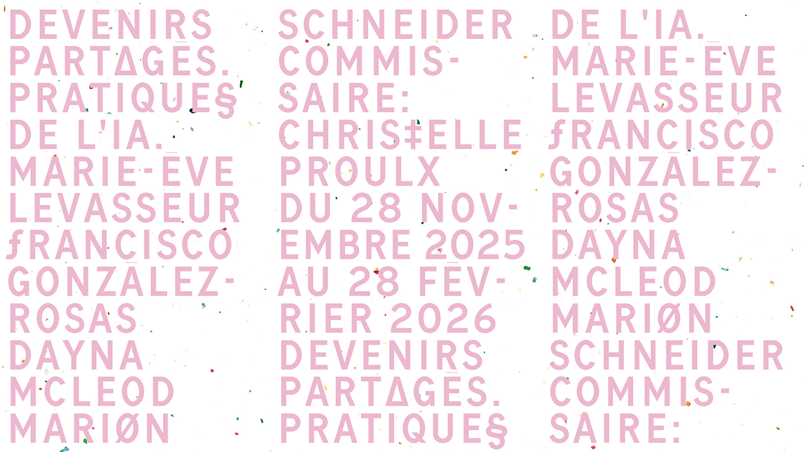
>Affiche principal

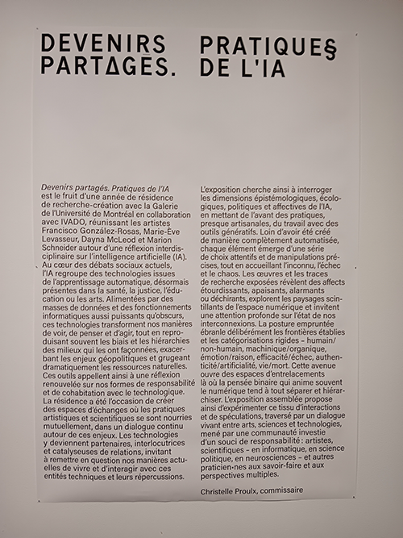
>Texte principal
- **Lieu:** Galerie de l’Université de Montréal

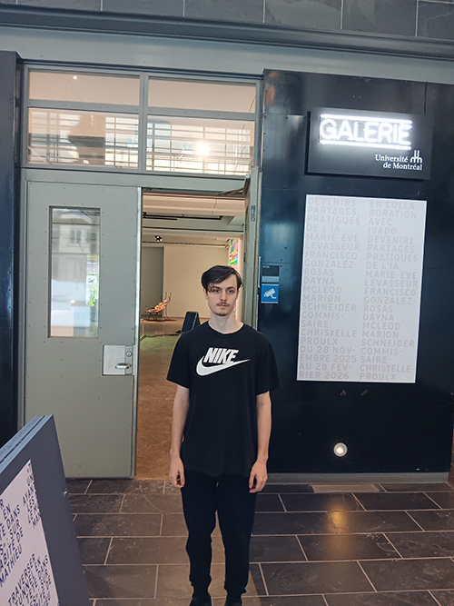
>Entrée de l'exposition
- **Type d'exposition:** Intérieur, temporaire
- **Date de visite:** 29 Janvier

## Oeuvre choisi
- **Titre de l'oeuvre:** Techno-Compost01(decomposition)Techno-Compost02(RBG noise and latent space as a garden)

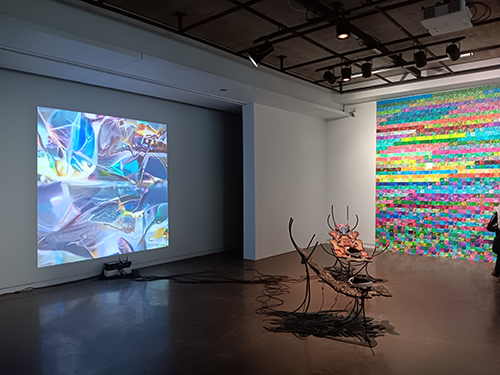
>Vue d'ensemble de l'oeuvre
- **Nom de l'artiste:** Marie-Ève Levasseur 
- **Année de réalisation:** 2025
- **Type d'instalation:** immersive
  
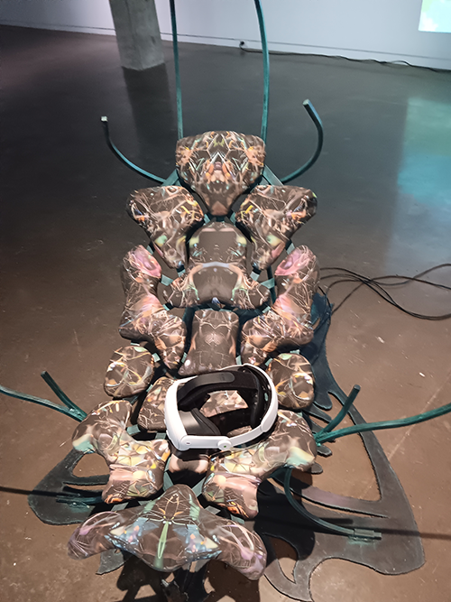
>Vue d'ensemble de l'instalation
- **Description de l'oeuvre:** scène fait en réalité virtuelle ou tu vois des déchêts virtuelle numérique fait par l'IA 

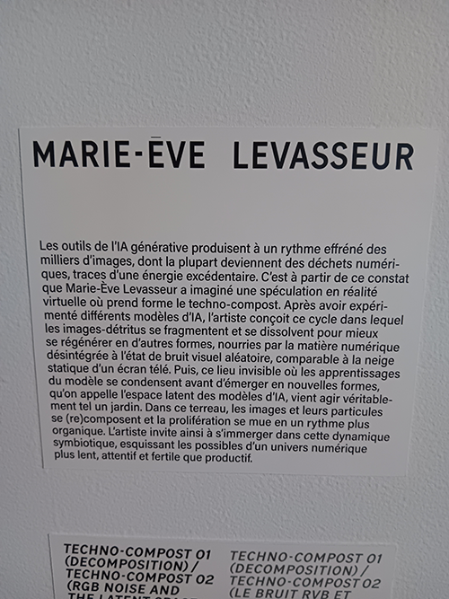
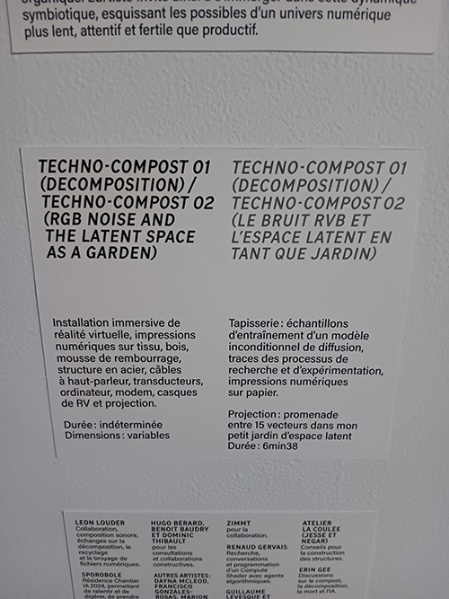
>Cartel de l'oeuvre
- **Mise en espace:** Chaise , casque vr , écran , mur de papier , internet

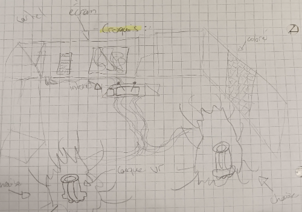
>croquis de la mise en espace de l'oeuvre
- **Composantes et Technique:** Chaise vibrante, Casque vr Meta , fils et cables , boîte internet 

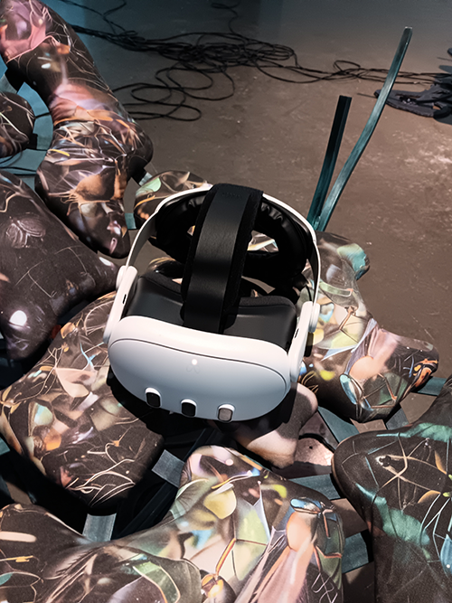
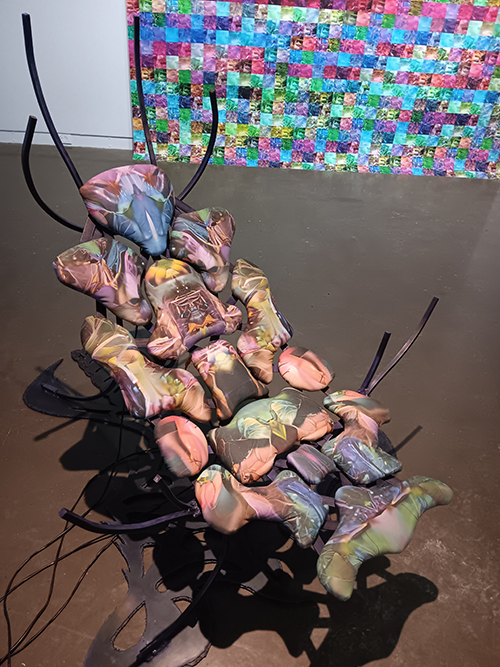
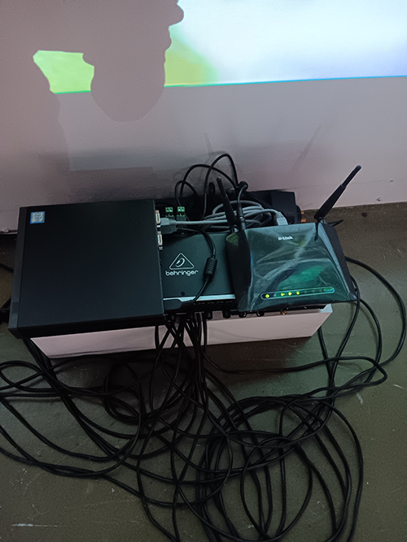
>Composantes de l'exposition
- **Éléments nécessaires à la mise en exposition:** Boîte en carton, pillier , mur , lumière

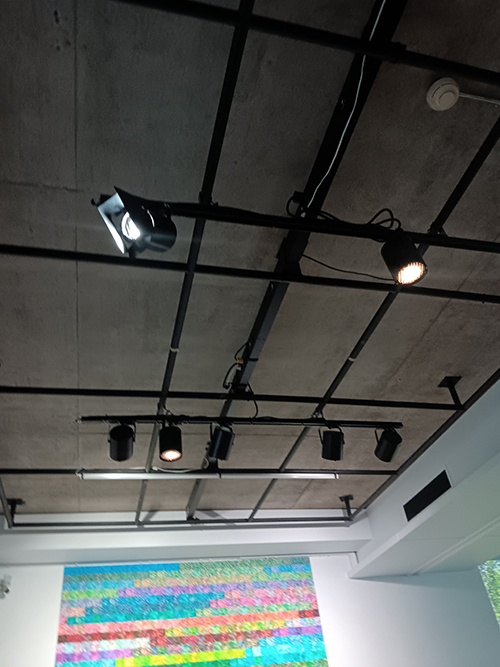
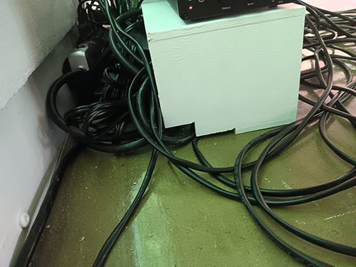
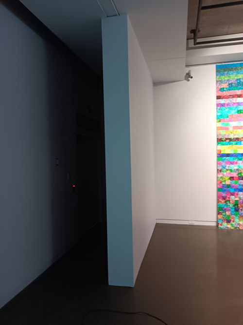
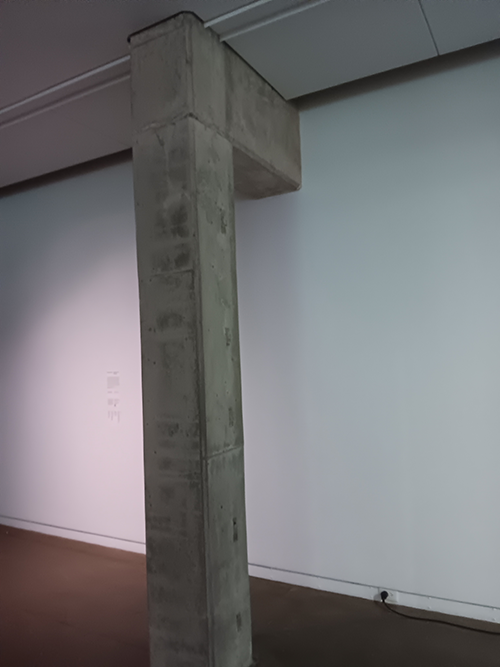
>Éléments nécessaires à la mise en exposition

## Expérience vécue
Le visiteur rentre dans la pièce et voie l'ensemble de l'oeuvre devant lui , un mur de papier coloré a droite , une projection d'une image a gauche et deux chaise fourni de casque. Le visiteur s'asseoit sur une chaise avec un design plutôt alien et puit équippe le casque de réalité virtuelle. le visiteur sent la chaise vibrer pendant l'expérience et voit un paysage créer a partir des déchêts de l'IA. Il y a une pluie d'image aléatoire qui se promène dans le paysage ou qui peuvent tomber au sol. Le visiteur peut aussi calibrer sa position dans l'expérience avec ses mains.

https://github.com/user-attachments/assets/c766e06d-91cc-4ce0-8bf2-504d24da1b22
>video de l'expérience de l'oeuvre

## Ce qui m'a plu, ce qui m'a donné des idées , ce que je ne souhaite pas retenir pour mes créations et ce que je ferais de différent
J'ai aimé les sons utilisées pedant l'expérience de réalité virtuelle , ca te donne une plus grande immersion. Le paysage en tant que tel n'étais pas asser développer à mon avis et peu intéressant. La chaise vibrante étais comfortable mais seulement une chaise sur 2 étais capable de vibrer. Le casque étais plutôt comfortable aussi. Ce que je changerai serait un plus gros environnement ou tu peut de déplacer et explorer avec l'utilisation des mains . Je rendrait aussi l'expérience en forme de glitch , ou le paysage changerai en une autre variation des paysages et images fait par l'IA après un moment prédéfini.

- **Références**[site web de l'exposition](https://galerie.umontreal.ca/devenirs-partagees-pratiques-de-lia.php)

