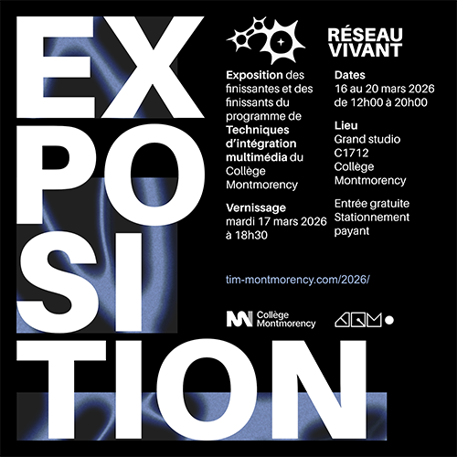
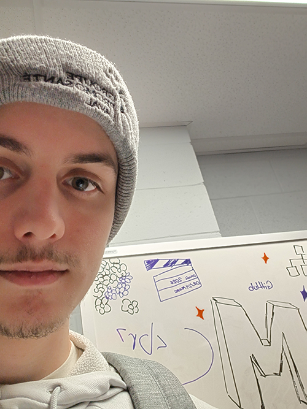
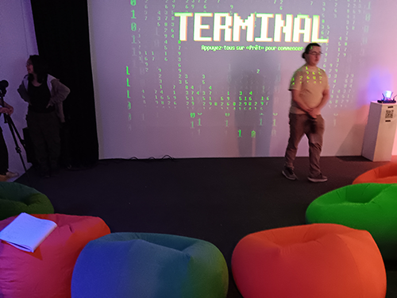
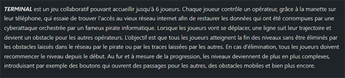
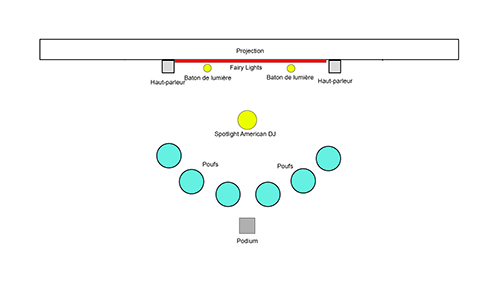
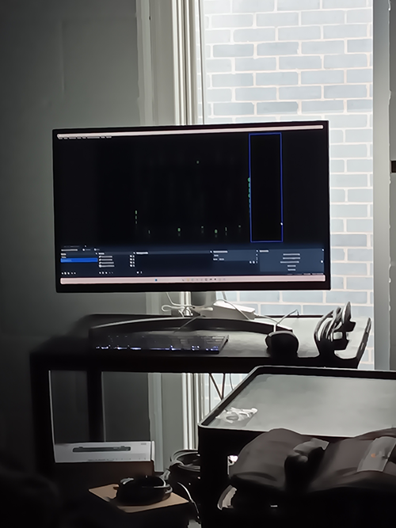
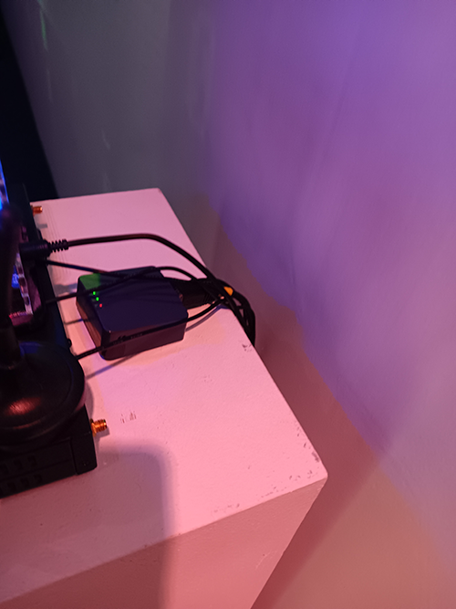
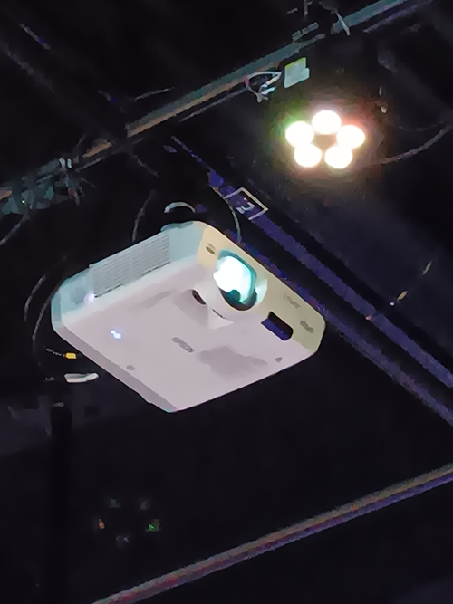

# Réseau-Vivant

une exposition sur les travaux(dispositifs) de fin d'année des étudiants en technique d'intégration multimédia

## Information générale de l'exposition

- **Nom de l'exposition:** Réseau vivant : exposition des finissantes et finissants 

 

>Affiche principale pris du site web de l'exposition(mentionné dans les références) , Prise par Colin Dubé

- **Lieu:** Grand Studio de Montmorency

>Entrée de l'exposition , Prise par Colin Dubé

- **Type d'exposition :** intérieur, temporaire

- **Date de visite:**  24 février, 17 mars 2026

## Dispositif choisie

- **Titre du dispositif :** TERMINAL

>Vue d'ensemble du dispositif , Prise par Colin Dubé

- **Nom des artistes:** Émeryk Bélisle , Elie Daher , Ting Yung Lu Terry , Dana Saavedra-Torrano , Mégane Ranger

- **Année de réalisation:** 2026

- **Type d'installation :** interactive

- **Description du dispositif :** Jeux multijoueur 2D ou tu peux bouger ton personnage en quatre direction a l'aide de ton téléphone pour arriver a une zone précise.

>Texte explicatif du dispositif , Prise du site web de l'équipe d'artiste(mentionné dans les références)

- **Mise en espace :** 

>Schéma de plantation du dispositif , Prise du site web de l'équipe d'artiste(mentionné dans les références)

- **Composantes et technique :** Qr code papier , router internet , projecteur , ordinateur 

>Composantes du dispositif , Prise par Colin Dubé

- **Éléments nécessaires à la mise en exposition:** Pillier , fil de ralonge , mur blanc 

>Éléments nécessaires à la mise en exposition , Prise du site web de l'équipe d'artiste(mentionné dans les références)

## Expérience vécue

Les personnes s'assoient chacun sur un poof avec leur téléphone en main. Pour se connecter à la  partie , la personne doit scanner le Qr code présenté. Pour jouer , tu peux bouger dans 4 directions avec les flèches sur le téléphone dont la gauche , la droite , en haut et en bas. De plus , il y a plusieurs chose que tu peux rammasser pour avoir des bonus sur ton personnages. Par exemple , tu deviens un fantôme avec immuniter contre les obstacles. Tous les joueurs doivent atteindre la zone de fin pour réussir le niveau et passer au prochain.

## Ce qui m'a plu, ce qui m'a donné des idées, ce que je ne souhaite pas retenir pour mes créations et ce que je ferai de différent

J'ai aimé le visuel rétro du jeux , l'idée de jeux à du potentiel mais je souhaiterai que les changements de directions soient plus fluides(il y a un délai après avoir touché une nouvelle direction).
Ce que je changerai serait seulement les poufs car il ne sont pas vraiment comfortable et une chaise normale moins cher ferait mieux l'affaire qu'un pouf de mauvaise qualité.

- **Références:**

 site web de l'équipe d'artiste(https://pythons-5.github.io/Terminal/#/equipe/)
 site web de l'exposition(https://tim-montmorency.com/2026/)
                  
- 
