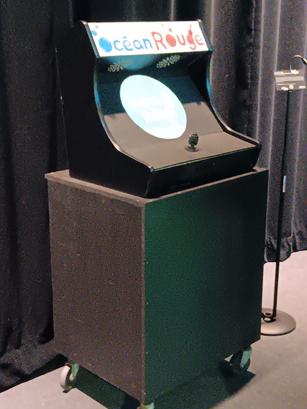
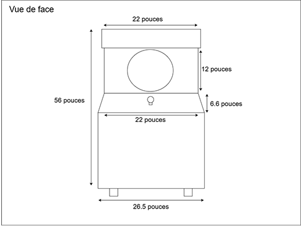
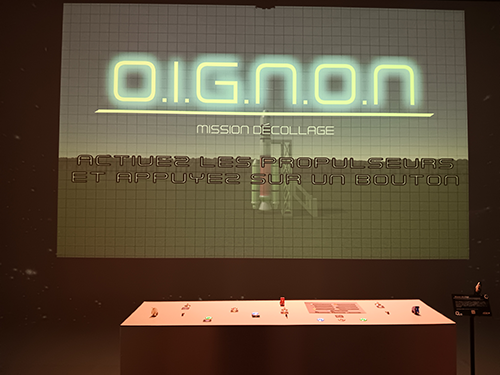
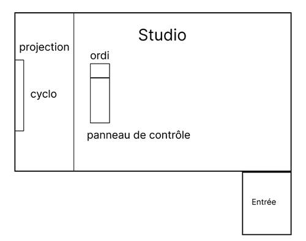
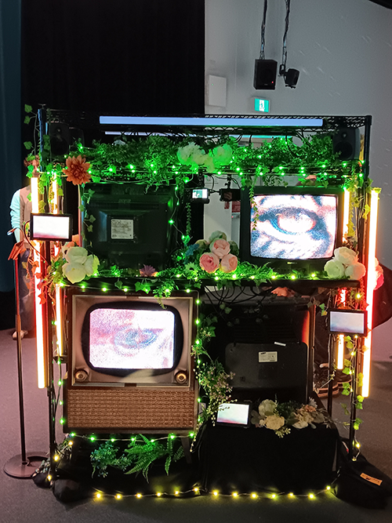
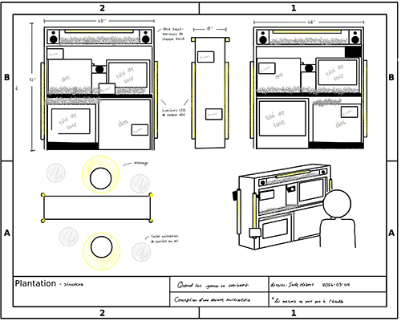
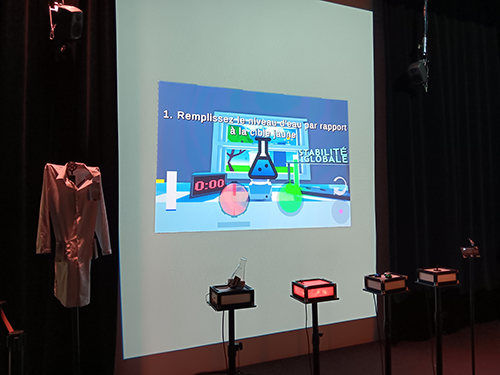
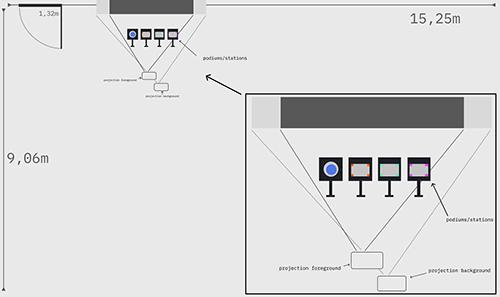
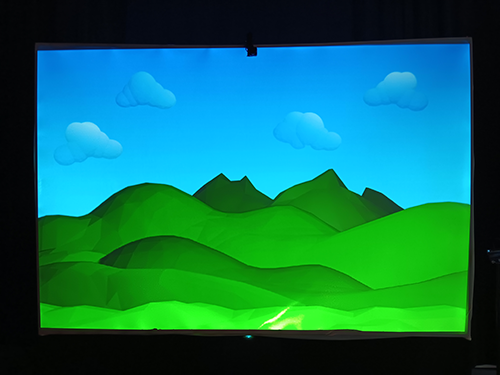
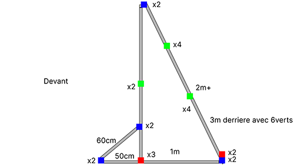

# Palmares

Classement et information sur les autres Dispositifs présenté a l'exposition Réseau-Vivant . De plus l'information sur les techniques encore inconnu pour les nouveaux étudiants du programme.

## 1. Océan Rouge 

- **Nom des artistes:** Amira Tounekti , Kristy Moussally

- **Installation finale:**

 

>Vue d'ensemble du dispositif , Prise par Colin Dubé

- **Schéma de plantationdu dispositif:**

 

>Schéma de plantation du dispositif, Prise du site web de l'équipe d'artiste(mentionné dans les références)

- **Ressentiment en expérimentant chacune des installations:** chose

## 2. Mission Décollage

- **Nom des artistes:** Amira Tounekti , Kristy Moussally

- **Installation finale:**

 

>Vue d'ensemble du dispositif , Prise par Colin Dubé

- **Schéma de plantationdu dispositif:**

 

>Schéma de plantation du dispositif, Prise du site web de l'équipe d'artiste(mentionné dans les références)

- **Ressentiment en expérimentant chacune des installations:** chose

## 3. Quand les yeux se croisent

- **Nom des artistes:** Amira Tounekti , Kristy Moussally

- **Installation finale:**

 

>Vue d'ensemble du dispositif , Prise par Colin Dubé

- **Schéma de plantationdu dispositif:**

 

>Schéma de plantation du dispositif, Prise du site web de l'équipe d'artiste(mentionné dans les références)

- **Ressentiment en expérimentant chacune des installations:** chose

## 4. Symbiose

- **Nom des artistes:** Amira Tounekti , Kristy Moussally

- **Installation finale:**

 

>Vue d'ensemble du dispositif , Prise par Colin Dubé

- **Schéma de plantationdu dispositif:**

 

>Schéma de plantation du dispositif, Prise du site web de l'équipe d'artiste(mentionné dans les références)

- **Ressentiment en expérimentant chacune des installations:** chose

## 5. Arbre en face

- **Nom des artistes:** Amira Tounekti , Kristy Moussally

- **Installation finale:**

 

>Vue d'ensemble du dispositif , Prise par Colin Dubé

- **Schéma de plantationdu dispositif:**

 

>Schéma de plantation du dispositif, Prise du site web de l'équipe d'artiste(mentionné dans les références)

- **Ressentiment en expérimentant chacune des installations:** chose
