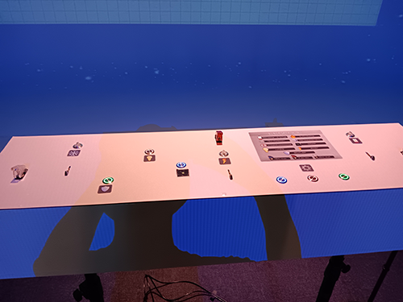
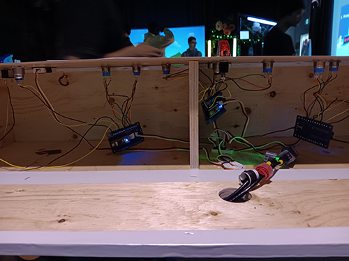

# Palmares

Classement et information sur les autres Dispositifs présenté a l'exposition Réseau-Vivant . De plus l'information sur les techniques encore inconnu pour les nouveaux étudiants du programme.

## 1. Océan Rouge 

- **Nom des artistes:** Amira Tounekti , Kristy Moussally

- **Installation finale:**

 

>Vue d'ensemble du dispositif , Prise par Colin Dubé

- **Schéma de plantationdu dispositif:**

 

>Schéma de plantation du dispositif, Prise du site web de l'équipe d'artiste(mentionné dans les références)

- **Ressentiment en expérimentant chacune des installations:**

c'est le fun , tu dois toucher rapidement le joystick pour rammaser les déchêts pour gagner . De plus , ta vision est   diminuer comme si tu avais un casque . 

## 2. Mission Décollage

- **Nom des artistes:** Amira Tounekti , Kristy Moussally

- **Installation finale:**

 

>Vue d'ensemble du dispositif , Prise par Colin Dubé

- **Schéma de plantationdu dispositif:**

 

>Schéma de plantation du dispositif, Prise du site web de l'équipe d'artiste(mentionné dans les références)

- **Ressentiment en expérimentant chacune des installations:** 

Ce n'est pas pire comme jeu , ce n'est pas vraiment mon style , mais c'est définitivement la plus complexe des dispositifs présenté.

## 3. Quand les yeux se croisent

- **Nom des artistes:** Amira Tounekti , Kristy Moussally

- **Installation finale:**

 

>Vue d'ensemble du dispositif , Prise par Colin Dubé

- **Schéma de plantationdu dispositif:**

 

>Schéma de plantation du dispositif, Prise du site web de l'équipe d'artiste(mentionné dans les références)

- **Ressentiment en expérimentant chacune des installations:**

C'est beau , probablement le dispositif ayant la décoration la plus extravagente et en thème avec son sujet.

## 4. Symbiose

- **Nom des artistes:** Amira Tounekti , Kristy Moussally

- **Installation finale:**

 

>Vue d'ensemble du dispositif , Prise par Colin Dubé

- **Schéma de plantationdu dispositif:**

 

>Schéma de plantation du dispositif, Prise du site web de l'équipe d'artiste(mentionné dans les références)

- **Ressentiment en expérimentant chacune des installations:** 

Pas trop apprécier le jeu , c'est basée sur un sujet que je n'aime peu , la science.

## 5. Arbre en face

- **Nom des artistes:** Amira Tounekti , Kristy Moussally

- **Installation finale:**

 

>Vue d'ensemble du dispositif , Prise par Colin Dubé

- **Schéma de plantationdu dispositif:**

 

>Schéma de plantation du dispositif, Prise du site web de l'équipe d'artiste(mentionné dans les références)

- **Ressentiment en expérimentant chacune des installations:**

  Aucun intérêt pour ce dispositif , il est frustrant a essayer et ne marche pas efficacement.

## En rapport avec le cheminement dans la formation en TIM

- **3 cours incontournables pour avoir les compécenes pour ce genre de projet:**

  Programmation , Réalité Mixte et Objet interactif

- **Une composante technologique utilisée dans le projet Mission Décollage que je ne connaissait pas:**

  Boîte de commande avec bouton et fil intégrés à l'intérieur de la boîte

  
  

  >Devant et arrière de la composante , Prise par Colin Dubé
