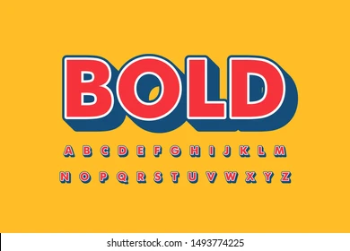

# Colin Dubé
>je suis un fan du sports comme le volleyball,le badminton et l'escalade, et du jeux vidéo.
>je suis quelqu'un qui cherche activement a trouver un but dans la vie qui pourrais me satisfaire pour trouver le bonheur.

## Intérêts dans le multimedia
Un de mes champs d'intérêt dans le multimédia est le vectoriel dans le photoshop ce qui te permet de faire dessin logo,etc.
Voici un exemple de signature vectoriel dont je me suis inspiré:

Voici le travail qui s'inspirait de l'image du haut

## Égoportrait et lien web
Voici une photo récente qui étais sur le moment un événement de nomination pour joueur de volleyball.

Voici une photo de mon enfance pendant l'haloween.

Voici un lien youtube d'une animation rubber hose(animation style 1930) en lien avec le projet:
chose

Et voici une des plusieurs page de création dont je me suis inspiré du style artistique du rubber hose.

