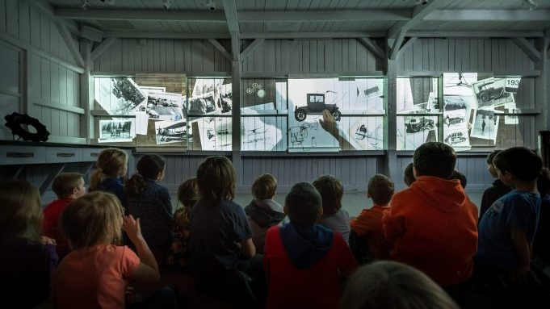

# Conférence sur le  Musée de l'ingéniosité Joseph Armand-Bombardier

 

>image du spectacle du garage pris du site web de l'exposition(https://museebombardier.com/expositions/histoires-de-passions/) 

## Rédaction

Martin Boucher a commencé par poser des questions aux étudiants de la conférence, par exemple : "Quelle exposition avez-vous vue récemment ?" Il a ensuite présenté une animation qui démontre la résolution.

de problème qui est important pour gérer un genre de projet comme une exposition de musée. Il a ensuite présenté en résumé l'ensemble des activités et équipements utilisés pour le projet.

Notamment comme activité : simulateur de vol, capsule vidéo informative, tablette interactive pour faire des véhicules, setup multiécran et jeux de lumière. Pour l'équipement, ils avaient besoin d'électricité, éclairage, MIDI, DMX, ordinateur, speaker, écrans. Finalement pour les applications et logiciels utilisés : Max MSP, Touch Designer, Ableton Light, Notch, Blender…

Martin Boucher a ensuite développé une des activités majeures nommée le garage. Le garage est un spectacle de projection vidéo, lumière et son sur plusieurs écrans qui présente l'histoire d'Armand Bombardier. Le garage joue beaucoup sur la spatialisation du son et de la lumière pour diriger le spectateur, il y a aussi un "magasin" où il y a un jeu de lumière sur des éléments archivés d'Armand Bombardier. 

Il finit par montrer une dernière section nommée le Métro, qui assemble un premier assemblage ou prototype d'un métro. Dans ce métro, il y avait une activité où il fallait deviner avec des boutons la fréquence de la musique.

En conclusion, Martin Boucher trouve que la partie interactive du musée est de bonne qualité, mais expliquer scientifiquement chaque notion à des enfants était compliqué.

